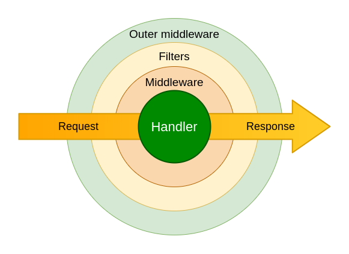

# Глава 1. Телеграм-бот.

## 1.1 Что такое телеграм-бот.

В первую очередь стоит уточнить, что же такое Телеграм-бот. Для этого можно обратится непосредственно к официальному сайту компании:

    "Боты - это небольшие приложения, которые полностью запускаются в приложении Telegram. Пользователи взаимодействуют с ботами через гибкие интерфейсы, которые могут поддерживать любые задачи или услуги."


Таким обазом можно сделать вывод, что в случае с ботом разработчик получает уже частично готовый интерфейс для своего приложения, в который имеет возможность интегрировать разнообразный функционал: веб-приложения, платежи, социальные сети, игры, а также интегрировать бота с другими сервисами.
Как правило крупные компании используют телеграм-ботов для клиентской поддержки, нередко интегрируя искусственный интеллект. Также телеграм боты заменяют небольшим компаниям и предпринимателям мобильные приложения: 
1. создание и поддержка телеграм-бота обходится компании дешевле
2. пользователю не требуется устанавливать дополнительное приложение на свое устройство.

## 1.2 Какими функциями обладают телеграм-боты.

### Входные данные

Бот может принимать текст, файлы, данные местоположения, стикеры, голосовые сообщения. Однако одной из важнейших функций телеграм-ботов является возможность принимать команды.

Бот определяет команду после ввода `/`. При этом любой текст или набор символов длинной до 32 знаков введенный после `/` будет определяться телеграм-ботом как команда, даже если такой команды для бота в программе на сервере не существует. Команда обрабатывается уже в программе, подключенной к боту, поэтому важно, чтобы команды были простыми и пользователь был авторизован, для их выполнения 

В качестве аналога командам можно использовать Клавиатуры. В боте можно отображать специальную клавиатуру с предопределенными вариантами ответов. Это помогает упростить и рационализировать взаимодействие пользователей с ботом. Можно использовать стандартные клавиатуры (используется ReplyKeyboardMarkup), которые доступны пользователю под полем ввода, или инлайн  клавиатуры (используется InlineKeyboardMarkup), которые прикрепляются к сообщению бота.

Также возможно использовать "Меню" самого телеграм-бота рядом с полем ввода сообщения. При нажатии открывается меню в котором можно увидеть некоторые команды бота. Их отображение также можно настроить для разных групп пользователей.

Пример:

```
class SetMyCommands(TelegramMethod[bool]):
    """
    Используйте этот метод, чтобы изменить список команд бота. Возвращает `True` при успешном выполнении.
    """

    __returning__ = bool
    __api_method__ = "setMyCommands"

    commands: List[BotCommand]
    """Сериализованный в формате JSON список команд бота, который будет задан в качестве списка команд бота. Можно указать не более 100 команд."""
    scope: Optional[BotCommandScope] = None
    """Объект, сериализованный в формате JSON, описывающий круг пользователей, для которых доступны команды. По умолчанию используется значение  :class:`aiogram.types.bot_command_scope_default.BotCommandScopeDefault`."""
    language_code: Optional[str] = None
    """Двухбуквенный код языка ISO 639-1. Если None, то команды будут применены ко всем пользователям из данной области, для языка которых нет выделенных команд"""

```
```
class GetMyCommands(TelegramMethod[List[BotCommand]]):
    """
    используется, чтобы получить текущий список команд бота для заданной области и языка пользователя. Возвращает массив объектов :class:`aiogram.types.bot_command.BotCommand` Если команды не заданы, возвращается пустой список.
    """

    __returning__ = List[BotCommand]
    __api_method__ = "getMyCommands"

    scope: Optional[BotCommandScope] = None
    """Объект, сериализованный в формате JSON, описывающий круг пользователей. По умолчанию используется значение :class:`aiogram.types.bot_command_scope_default.BotCommandScopeDefault`."""
    language_code: Optional[str] = None
    """Двухбуквенный код языка ISO 639-1 или пустая строка"""
 ```

## 1.3 Библиотеки Python для телеграм-бота

Для написания телеграм-ботов существует множество библиотек для Python,  они различаются функциональностью, популярностью и размером сообществ.

TeleBot. Библиотека для создания простых ботов, позволяющая работать с асинхронным и синхронным подходом на выбор. Подходит для небольших проектов.

Python-telegram-bot. Одна из первых библиотек для создания ботов. Отличается тем, что не поддерживает асинхронность при работе. При ожидании ответа от пользователя выполнение кода останавливается.

Aiogram. Современная  библиотека, которая реализует асинхронное выполнение кода, что позволяет не останавливать работу бота в ожидании ответа пользователя. 

Именно aiogram мы будем использовать в нашем проекте, так как одно из главных достоинств библиотеки — полная асинхронность. Она использует синтаксис async/await, который позволяет программе выполнять несколько задач одновременно и эффективно управлять потоком выполнения.

Функция, которая обрабатывает сообщение пользователя в Telegram, называется хендлером, то есть обработчиком. У каждой команды или группы команд свой обработчик.

В хендлере мы прописываем, что бот должен сделать в ответ на сообщение. А для того, чтобы для каждой команды вызывался нужный обработчик, функция оборачивается в декоратор, которому передаётся имя команды без символа /.

Служебное слово async указывает интерпретатору, что функция будет работать в асинхронном режиме. Это означает, что интерпретатору не нужно ждать, пока выполняется код функции, — он может выполнять следующие инструкции, пока start что-нибудь не вернёт. Это «что-нибудь» следует за служебным словом await («ожидать»), а не return, как в обычном коде.

Библиотека обеспечивает полный доступ ко всем возможностям Telegram API, включая отправку и получение сообщений, управление клавиатурой, обработку медиафайлов (фотографий, видео, документов) и многое другое.


## 1.4 Middleware в телеграм-боте

Middleware (промежуточное или связующее программное обеспечение) — это фрагмент кода в конвейере приложения, используемый для обработки запросов и ответов.

В приложении может быть middleware-компонент для аутентификации пользователя, middleware-компонент для обслуживания статических файлов и еще один middleware-компонент для обработки ошибок и т. д.
Существует большое разнообразие middleware. Одни сосредоточены на определенных формах соединения с операционной системой, другие уделяют внимание конкретным программам, программным компонентам и устройствам. Некоторые сочетают в себе middleware программных функций для поддержки требований к разработке приложений. Ниже перечислены некоторые из наиболее широко используемых middleware программ:

* Интерфейс прикладного программирования (API)

Это набор инструментов для создания программного обеспечения, например, API для создания мобильных приложений на определенной платформе.

* Сервер приложений

Корпоративные приложения разрабатываются и выполняются на веб-серверах приложений и программных фреймворках обмена сообщениями.

* Middleware ориентированный на контент

Системы управления контентом получают конкретные данные, используя абстракцию "поставщик-потребитель".

* Встраиваемая платформа middleware

Связь и интегрирующий интерфейс для встроенных программ, программных платформ и сервисов обеспечиваются встроенными middleware.

* MOM (ориентированная на сообщения)

Ориентированная на сообщения middleware инфраструктура позволяет обмениваться информацией между распределенными приложениями или программными middleware компонентами.

* База данных middleware

База данных middleware облегчает взаимодействие с внутренними базами данных и получение информации из них. Серверы баз данных SQL middleware часто используются в качестве базы данных middleware.

* Middleware для интеграция корпоративных приложений

Компания может создать центр корпоративной интеграции, используя интеграцию корпоративных приложений middleware, которая представляет собой определенный метод соединения всех приложений, программных модулей, бизнес-операций и внутренних источников информации на всем предприятии

В библиотеке aiogram  также есть возможность добавить middleware  в программу. Существует два вида: внешние (outer) и внутренние (inner) middleware. Outer выполняются до начала проверки фильтрами, таким образом это значит что update/message/callback проходящий через middleware, может не попасть ни в один handler. Inner обрабатывает данные уже после поэтому объект всегда попадает в какой-либо handler.



```
class BaseMiddleware(ABC):
    """
    Общий класс промежуточного программного обеспечения
    """

    @abstractmethod
    async def __call__(
        self,
        handler: Callable[[TelegramObject, Dict[str, Any]], Awaitable[Any]],
        event: TelegramObject,
        data: Dict[str, Any],
    ) -> Any:  # pragma: no cover
        pass
```

Каждая мидлварь, построенная на классах (впрочем, возможны и иные варианты), должна реализовывать метод __call__() с тремя аргументами:

`handler` — собственно, объект хэндлера, который будет выполнен. Имеет смысл только для inner-мидлварей, т.к. outer-мидлварь ещё не знает, в какой хэндлер попадёт апдейт.

`event` — тип Telegram-объекта, который обрабатываем. Обычно это Update, Message, CallbackQuery или InlineQuery (но не только). Если точно знаете, какого типа объекты обрабатываете, смело пишите, например, Message вместо TelegramObject.

`data` — связанные с текущим апдейтом данные: переданные дополнительные поля из фильтров, FSM, флаги и т.д. В него же мы можем положить из middleware какие-то свои данные, которые будут доступны в виде аргументов в handler.

Одной из самых простых функций middleware  в телеграм-боте может быть блокировка рпботы с ботом отдельного пользователя или группы пользователей. Лучше всего для этого подходит outer-middleware на Update, как самый ранний этап обработки запроса пользователя. Middleware кладёт в data словарик с информацией о пользователе по ключу event_from_user. Далее можно получать оттуда ID пользователя, сравнивать с каким-либо списком заблокированных и просто делать return, чтобы предотвратить дальнейшую обработку по цепочке.